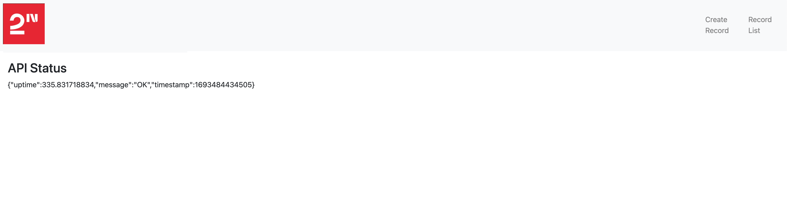

# DevOps CASE — MERN + Python ETL on AWS EKS

Two workloads deployed to a single EKS cluster, with full CI/CD via GitHub Actions and IaC via Terraform.

| Layer | Tech |
|---|---|
| Client | React (CRA) → nginx |
| Server | Node.js / Express on MongoDB |
| Database | MongoDB 7 (StatefulSet + 10Gi gp3 PVC) |
| Scheduled job | Python ETL (`ETL.py`) — CronJob `0 * * * *` |
| Cluster | AWS EKS 1.30 in private subnets across 3 AZs |
| Ingress | AWS ALB via AWS Load Balancer Controller |
| Registry | ECR (3 repos) |
| CI/CD | GitHub Actions, OIDC (no static keys) |
| Logging | Fluent Bit → CloudWatch Logs |
| Alerts | CloudWatch Alarms → SNS → email |
| IaC | Terraform |

## Repo layout

```
mern-project/   client + server source, Dockerfiles, nginx.conf
python-project/ ETL.py + Dockerfile + requirements.txt
k8s/            Kubernetes manifests + kustomization.yaml
terraform/      VPC, EKS, ECR, IAM/IRSA, ALB controller, observability
.github/workflows/  ci.yml, build-and-push.yml, deploy.yml
docs/           architecture.md, deployment.md, runbook.md
docker-compose.yml  one-command local stack
```

## Quick start (local)

```bash
docker compose up --build
open http://localhost:3000          # client (matches result.png)
curl  http://localhost:5050/healthcheck/
```

## Deploy to AWS

See **[docs/deployment.md](docs/deployment.md)** — full walkthrough from `terraform init` to public ALB URL.

## Operate

See **[docs/runbook.md](docs/runbook.md)** — logs, rollback, scaling, alerts, common issues.

## Architecture

See **[docs/architecture.md](docs/architecture.md)** — diagram, components, networking, security baseline.

---

## Acceptance Criteria coverage

### MERN

| AC | Status |
|---|---|
| MongoDB connected | StatefulSet + Service `mongo.mern.svc.cluster.local:27017`; secret `mongo-secret` injects `ATLAS_URI` |
| All endpoints work | server `/healthcheck`, `/record` CRUD verified via Cypress in CI and `curl` in runbook |
| All pages work | client routes `/`, `/records`, `/create`, `/edit/:id` served via ALB; `REACT_APP_API_URL` baked at build for env-specific origin |

### Python

| AC | Status |
|---|---|
| `ETL.py` runs every 1 hour | K8s CronJob `schedule: "0 * * * *"`, `concurrencyPolicy: Forbid` |
